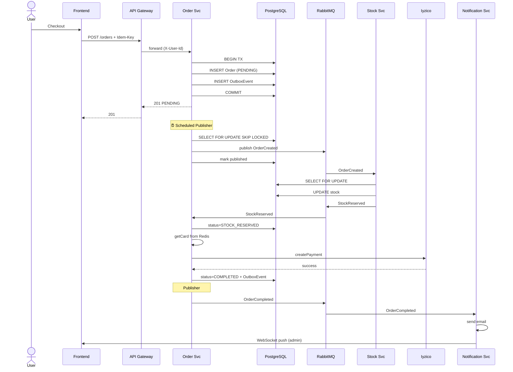

# Saga Flow — Detaylı Sequence Diagram

## Happy Path (Başarılı Sipariş)

```
Frontend          API Gateway      Order Service      Outbox      RabbitMQ      Stock Service     Iyzico       Notification
   │                  │                  │              │            │                │             │                │
   │ POST /orders     │                  │              │            │                │             │                │
   │ Idempotency-Key  │                  │              │            │                │             │                │
   ├─────────────────►│                  │              │            │                │             │                │
   │                  │ JWT validate     │              │            │                │             │                │
   │                  │ X-User-Id ekle   │              │            │                │             │                │
   │                  ├─────────────────►│              │            │                │             │                │
   │                  │                  │ check idem.  │            │                │             │                │
   │                  │                  │ key (UNIQUE) │            │                │             │                │
   │                  │                  │              │            │                │             │                │
   │                  │                  │ Order(PENDING)│           │                │             │                │
   │                  │                  ├──────────────►            │                │             │                │
   │                  │                  │              │            │                │             │                │
   │                  │                  │ OutboxEvent  │            │                │             │                │
   │                  │                  │ (OrderCreated)│           │                │             │                │
   │                  │                  ├──────────────►            │                │             │                │
   │                  │                  │              │            │                │             │                │
   │                  │                  │ Card → Redis │            │                │             │                │
   │                  │                  │ (15dk TTL)   │            │                │             │                │
   │                  │ ◄──────────────┤              │            │                │             │                │
   │ ◄────────────────┤ 201 PENDING      │              │            │                │             │                │
   │                  │                  │              │            │                │             │                │
   │                                                    │            │                │             │                │
   │                            ⏰ Outbox Publisher (her 2sn) çalışır                 │             │                │
   │                                     │              │            │                │             │                │
   │                                     │ poll unpublished events (SKIP LOCKED)      │             │                │
   │                                     │              │            │                │             │                │
   │                                     │              │ pending evt│                │             │                │
   │                                     │ ◄────────────┤            │                │             │                │
   │                                     │              │            │                │             │                │
   │                                     │ publish      │            │                │             │                │
   │                                     ├─────────────────────────►│                │             │                │
   │                                     │              │            │                │             │                │
   │                                     │              │            │ OrderCreated   │             │                │
   │                                     │              │            ├──────────────►│             │                │
   │                                     │              │            │                │             │                │
   │                                     │              │            │     SELECT FOR UPDATE        │                │
   │                                     │              │            │     stoğu düş                │                │
   │                                     │              │            │                │             │                │
   │                                     │              │            │ StockReserved  │             │                │
   │                                     │              │            │ ◄──────────────┤             │                │
   │                                     │              │            │                │             │                │
   │                                     │              │            │ to order queue │             │                │
   │                                     │              │            │                │             │                │
   │                            @RabbitListener StockReserved        │                │             │                │
   │                                     │              │            │                │             │                │
   │                                     │ Order: STOCK_RESERVED     │                │             │                │
   │                                     │ → PAYMENT_PROCESSING      │                │             │                │
   │                                     │              │            │                │             │                │
   │                                     │ getCard(orderId) from Redis                │             │                │
   │                                     │              │            │                │             │                │
   │                                     │ POST /payment (Iyzico SDK)                 │             │                │
   │                                     ├───────────────────────────────────────────────────────►│                │
   │                                     │                                            │             │                │
   │                                     │ paymentId, success                         │             │                │
   │                                     │ ◄───────────────────────────────────────────────────────┤                │
   │                                     │              │            │                │             │                │
   │                                     │ Order: COMPLETED          │                │             │                │
   │                                     │              │            │                │             │                │
   │                                     │ OutboxEvent (OrderCompleted)               │             │                │
   │                                     ├──────────────►            │                │             │                │
   │                                     │              │            │                │             │                │
   │                            ⏰ Outbox Publisher                  │                │             │                │
   │                                     │              │            │ OrderCompleted │             │                │
   │                                     │              │            ├──────────────────────────────────────────────►│
   │                                     │              │            │                │             │                │
   │                                     │              │            │                │             │  send email    │
   │                                     │              │            │                │             │  WebSocket push│
   │                                     │              │            │                │             │  (admin DB)    │
   │                                                                                                                  │
```

## Compensation Path (Stok Yetersiz)

```
Order Service ──OrderCreated──► Stock Service
                                    │
                                    │ stok yetersiz
                                    ▼
                              StockRejected
                                    │
                                    ▼
Order Service ◄─────────────────────┘
    │
    ▼
Order: CANCELLED + OrderCancelledEvent → Notification (mail "üzgünüz, stok kalmadı")
```

## Compensation Path (Payment Failed)

```
Order Service ─StockReserved─► Iyzico (FAIL)
                                    │
                                    ▼
PaymentFailed ──────────────► Stock Service (release stok = compensation)
    │
    ▼
Order: CANCELLED + OrderCancelledEvent → Notification
```

## Failure Modes ve Çözümleri

| Failure | Etki | Çözüm |
|---------|------|-------|
| RabbitMQ down | Event publish edilemez | Outbox tablosunda bekler, publisher retry yapar |
| Stock Service down | Saga ilk adımda kalır | Order PENDING durumunda kalır, ops alarm + manuel intervention |
| Iyzico down/timeout | Payment hatası | PaymentFailed → stok release (compensation) |
| Order Service crash | Order yarım kalabilir | Outbox event'leri persist olduğu için restart sonrası publisher devam eder |
| Duplicate event | At-least-once delivery sonucu | OrderStatus state guard duplicate transition'ı engeller |
| Card cache TTL bitti (15dk) | Payment yapılamaz | Order CANCELLED, kullanıcı tekrar denemeli |

## Sequence Diagram Mermaid

Gerçek diagram için bu kodu mermaid.live'a yapıştır:


